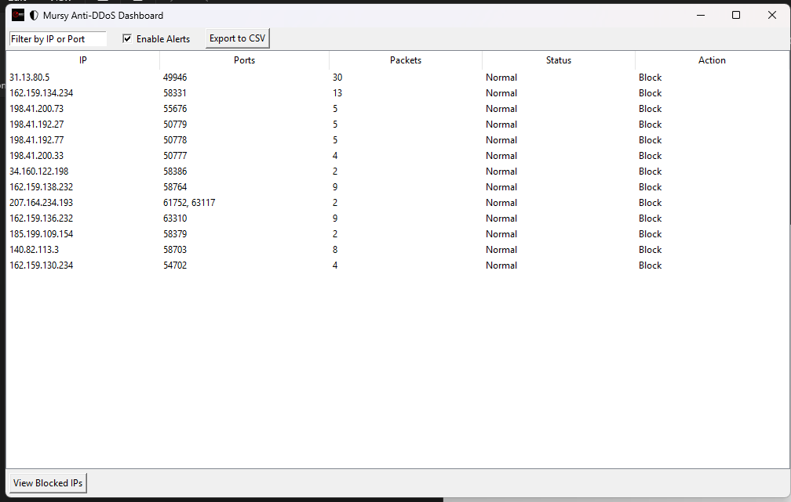

# 🛡️ Mursy Anti-DDoS Dashboard

A Python-based desktop application with a GUI built using Tkinter that monitors network traffic in real-time to detect and alert on potential DDoS attacks. It includes actionable controls like blocking/unblocking IPs, system tray alerts, CSV exporting, and more.

 <!-- Add an actual screenshot named screenshot.png -->

---

## 🚀 Features

- 📊 **Live Traffic Table** – Displays IPs, destination ports, packet counts, and threat status.
- ⛔ **Block/Unblock IPs** – Instantly manage firewall rules through the GUI.
- 💾 **Export to CSV** – Save current session traffic data.
- 🔎 **IP/Port Filtering** – Quick search by IP address or port number.
- 📣 **Windows Notifications** – Real-time alerts on DDoS detection.
- 🌐 **Public IP Whitelisting** – Automatically adds your public IP to the whitelist.
- 🛎️ **System Tray Integration** – Background monitoring with colored icon indicators.
- ⚙️ **Firewall Automation** – Uses `netsh` to enforce IP bans on Windows.

---

## 📦 Requirements

- Python 3.8+
- Admin privileges (for firewall rules and packet sniffing)

### Install dependencies:

```bash
pip install -r requirements.txt
```
requirements.txt should include:
```txt
scapy
pystray
Pillow
plyer
```
🧠 How it Works
Sniffs all incoming IP traffic using Scapy.

Keeps a running total of packet counts per IP per time window.

Compares traffic thresholds and flags DDoS-suspect IPs.

Lets the user block/unblock those IPs via Windows Firewall.

Alerts the user via system tray icon changes and native notifications.

🖼️ UI Overview
Main Table – Lists active IPs with port, packet count, and action buttons.

Filter Bar – Enter an IP or port to isolate traffic.

Toolbar – View blocked IPs, export data, or toggle alert sounds.

Tray Icon – Red when DDoS is detected, green when safe.

🔐 Firewall Interaction
Blocked IPs are handled using:

```bash
netsh advfirewall firewall add rule name="Block <IP>" dir=in action=block remoteip=<IP>
```
Unblocked IPs are removed using:

```bash
netsh advfirewall firewall delete rule name="Block <IP>"
```
🔧 Configuration
You can tune detection sensitivity by editing these constants in the script:

```python
THRESHOLD = 5000  # Packets in time window before flagging
MONITOR_SECONDS = 5  # Traffic window duration
MAX_HISTORY = 60  # Seconds of packet history
```
✅ To-Do
 Cross-platform support (Linux/Mac firewall integration)

 Auto-update feature

 Logging panel

 Graph view for traffic over time

🧪 Running the App
```bash
python your_script_name.py
```
Run as administrator on Windows for full functionality (firewall + sniffing).

📜 License
This project is licensed under the MIT License – see the LICENSE file for details.
